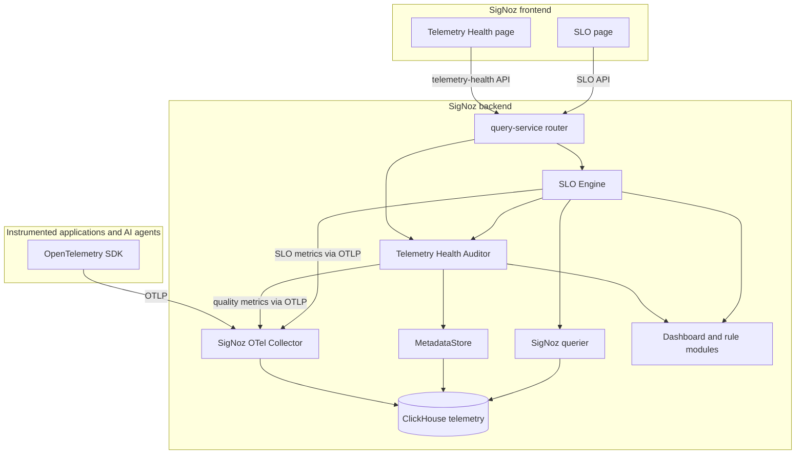
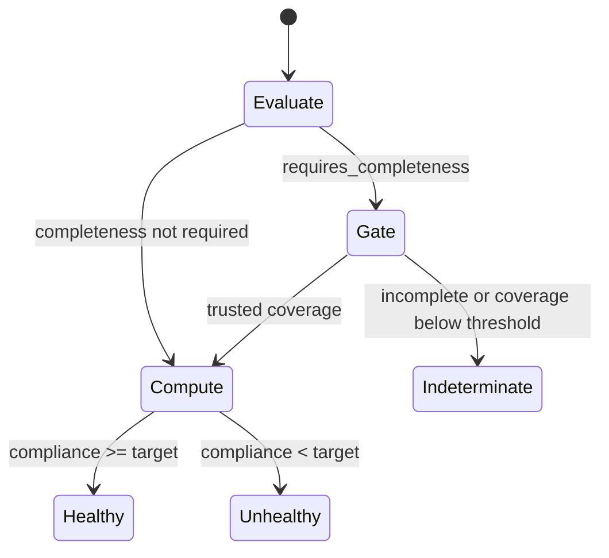

# PRD: Inbuilt Telemetry Health Auditor and SLO Engine

**Status:** Draft for implementation  
**Owner:** Reliability/Observability Engineering  
**Target:** `guruvedhanth-s/signoz` fork  
**Release:** Hackathon MVP

---

## 1. Executive summary

SigNoz should be able to evaluate whether the telemetry it receives is trustworthy enough to support debugging, dashboards, and SLO evaluation.

The product adds two related but independent reliability capabilities inside SigNoz:

1. **Telemetry Health Auditor** checks the quality, completeness, freshness, and structure of telemetry.
2. **SLO and Error-Budget Engine** evaluates configured SLIs and SLOs using trusted telemetry.

The most important boundary is that the Telemetry Health Auditor does not decide whether an SLO passes or fails. It reports telemetry-quality findings, a quality score, and an evidence-coverage result. The SLO Engine consumes that result as a completeness gate and owns SLO compliance, error-budget, burn-rate, and `healthy`/`unhealthy`/`indeterminate` decisions.

This separation prevents a missing attribute or incomplete query from being misrepresented as an SLO violation. It also prevents a high telemetry-quality score from being presented as proof that an SLO is met.

The implementation reuses SigNoz module, metadata, querier, dashboard, rule, and OpenTelemetry primitives. The MVP must remain deterministic: an optional LLM can explain a finding, but it must never calculate or change a score, SLI, SLO state, or alert threshold.

## 2. Problem statement

Observability decisions are only as good as the telemetry behind them.

An AI-agent request may include a root operation, retrieval, tool calls, model generation, evaluation, and correlated logs. A request can return HTTP 200 while still having missing `service.name`, missing model metadata, absent token usage, broken parent-child relationships, or unbounded metric attributes.

SigNoz can store and visualize the data, but operators also need to know:

1. Can the telemetry be trusted?
2. Is the telemetry complete enough to evaluate a configured SLO?
3. If it is complete, is the SLO being met?

The first two questions are telemetry-quality questions. The third is an SLO question. The product must expose them separately.

## 3. Goals

### 3.1 Telemetry Health Auditor goals

- Provide a deterministic telemetry-quality score per service and signal.
- Run at least five quality checks against real telemetry.
- Return stable findings with severity, affected signal, evidence, and recommendation.
- Distinguish `pass`, `fail`, and `indeterminate` for every audit rule.
- Report query completeness and evidence coverage explicitly.
- Emit the audit score and finding counts as bounded metrics.
- Provide an in-product page showing the score and actionable findings.
- Link each finding to the affected SigNoz explorer view where safe and useful.
- Work with self-hosted SigNoz.

### 3.2 SLO Engine goals

- Define SLOs as typed, version-controlled YAML.
- Support ratio, latency-threshold, completeness, and grounded-answer SLI types.
- Calculate compliance, error budget, and burn rate over explicit windows.
- Use the auditor as a completeness gate when configured.
- Preserve `indeterminate` when required telemetry is unavailable or incomplete.
- Generate SLO dashboards and burn-rate alerts idempotently.
- Emit SLO results as bounded OpenTelemetry metrics.

### 3.3 Shared goals

- Use deterministic calculations and reproducible test data.
- Use service, environment, and time-window scoping for every query.
- Avoid destructive remediation.
- Keep secrets and sensitive payloads out of reports, logs, labels, and dashboards.
- Reuse existing SigNoz primitives instead of rebuilding ingestion, storage, or query infrastructure.

## 4. Non-goals

The MVP does not:

- Use an LLM to calculate a score, SLI, SLO, error budget, or burn rate.
- Treat telemetry quality as SLO compliance.
- Return SLO state from the telemetry-health endpoint.
- Apply instrumentation fixes automatically.
- Delete telemetry or perform destructive remediation.
- Rebuild SigNoz ingestion, storage, dashboards, alerting, or LLM tracing.
- Depend on SigNoz Cloud-only features.
- Infer an SLO definition from natural language.
- Replace SigNoz as the system of record for raw telemetry.

## 5. Product boundary

The following distinction is mandatory:

| Question | Owner | Output |
| --- | --- | --- |
| Is the telemetry present and structurally valid? | Telemetry Health Auditor | Findings, quality score, coverage, audit status |
| Can the configured SLO be trusted for this window? | SLO completeness gate | Trusted or indeterminate gate result |
| Is the SLI above the target? | SLO Engine | Healthy or unhealthy SLO state |
| How quickly is the error budget being consumed? | SLO Engine | Error budget and burn rate |

The audit response must not contain `slo_status`, `slo_compliance`, `error_budget_remaining`, `burn_rate`, or an `slo_impact` field. The SLO response may include audit coverage as supporting evidence, but the audit response must remain independent of SLO results.

## 6. Personas and user stories

### Application developer

- As a developer, I want one quality score so I know whether my telemetry can be trusted.
- As a developer, I want each finding to identify the affected signal and evidence.
- As a developer, I want a copy-pasteable instrumentation recommendation.
- As a developer, I want incomplete telemetry clearly distinguished from an SLO failure.

### Platform or SRE owner

- As a platform owner, I want a quality trend per service.
- As an SRE, I want SLOs defined as code and evaluated consistently.
- As an SRE, I want an SLO to become indeterminate when its source telemetry cannot be trusted.
- As an SRE, I want multi-window burn-rate alerts generated without duplicates.

## 7. Scope

The MVP has two coordinated tracks. The only coupling between the tracks is the typed completeness-gate interface.

### Track A: Telemetry Health Auditor

- Backend module `telemetryhealth`.
- `GET /api/v1/telemetry-health` endpoint.
- At least five deterministic checks.
- Weighted score and coverage calculation.
- OTLP emission of quality metrics.
- Telemetry Health page with score and findings.
- Deep links to relevant SigNoz views.

### Track B: SLO and Error-Budget Engine

- Typed YAML SLO definitions.
- Four SLI types.
- Healthy/unhealthy/indeterminate state machine.
- Completeness gate calling the auditor.
- Error budget and multi-window multi-burn-rate calculations.
- OTLP emission of SLO metrics.
- Generated SLO dashboard and alerts.
- SLO page showing compliance, budget, burn rate, and trust state.

### Stretch

- LLM-generated prose and SDK snippets per finding.
- Additional trace, log, and metric quality rules.
- A human-approved pull-request patch for remediation.

## 8. Architecture



### 8.1 Module responsibilities

#### Telemetry Health Auditor

The auditor reads telemetry metadata and bounded query results, runs deterministic rules, calculates quality score and coverage, and returns a telemetry-health report.

It must not call the SLO evaluator to determine its status.

#### SLO Engine

The SLO Engine loads configuration, evaluates the SLI, checks completeness when required, calculates error budget and burn rate, emits SLO metrics, and reconciles SLO resources.

#### Completeness gate

The gate is a narrow interface from the SLO Engine to the auditor. It returns whether the evidence is trusted for the requested service, environment, and time window. It does not pass SLO state back into the audit module.

## 9. Supported telemetry profile

The first profile is `support-agent`.

### 9.1 Required resource identity

Every required signal must include:

- non-empty `service.name`;
- a consistent service identity across traces, logs, and metrics;
- `deployment.environment` when the deployment supplies an environment.

All live queries must accept and apply both service and environment filters.

### 9.2 Required trace structure

Each agent request must contain one root span:

```text
span.name = agent.run
```

Expected child operations:

| Operation | Span name | Required information |
| --- | --- | --- |
| Retrieval | `retrieve.documents` | Retrieval query and result status. |
| Tool | `tool.search_knowledge_base` | Tool result status. |
| Model | `model.chat` | Provider, model, and token usage. |
| Evaluation | `evaluation.groundedness` | Structured grounding verdict. |

Child spans must have a parent in the same trace. Failed operations must carry error status and structured failure evidence.

### 9.3 Required model metadata

Every model span must contain:

- provider;
- requested model name;
- input token usage;
- output token usage.

### 9.4 Required metric profile

The profile must provide window-queryable metrics equivalent to:

| Logical metric | Type | Meaning |
| --- | --- | --- |
| `agent.requests` | Counter | Total agent requests. |
| `agent.success` | Counter | Successful agent requests. |
| `agent.errors` | Counter | Failed agent requests. |
| `agent.duration` | Histogram | Agent request duration. |
| `agent.grounded_answers` | Counter | Grounded answers. |
| `agent.grounded_answers_total` | Counter | Evaluated answers. |

The storage-normalized names used by the SigNoz query layer must be documented in the SLO configuration. A cumulative counter must not be used as a window total without `increase`, `rate`, or an equivalent window-aware expression.

### 9.5 Log correlation

At least 95% of agent logs in the audit window must correlate to a trace span through trace and span context or equivalent structured fields.

### 9.6 Cardinality policy

Metric attributes must be bounded. Trace IDs, span IDs, request IDs, user IDs, prompt text, document contents, and arbitrary error strings must not be metric labels.

## 10. Telemetry Health Auditor

### 10.1 Audit inputs

The auditor accepts:

```text
service      required service name
environment  deployment environment, when configured
window       bounded duration, default 24h
signal       traces, metrics, logs, or all
```

The auditor must validate the duration and enforce a maximum query window and result limit.

### 10.2 MVP check catalog

Every check has a stable ID, version, severity, signal, pass condition, evidence shape, and recommendation.

| Check ID | Severity | Detects | Evidence source |
| --- | --- | --- | --- |
| `missing_service_name` | critical | Required telemetry without a valid service identity. | Metadata and bounded signal query. |
| `missing_model_name` | critical | Model spans without model/provider metadata. | Trace attributes. |
| `missing_token_usage` | warning | Model spans without input/output token usage. | Trace attributes. |
| `high_cardinality_attribute` | warning | Attributes exceeding configured distinct-value limits. | Metadata values and metric statistics. |
| `stale_service` | warning | Required service activity absent beyond the freshness threshold. | Last-seen metadata. |

The following checks are phase-two candidates:

| Check ID | Detects |
| --- | --- |
| `broken_trace_context` | Invalid parent-child relationships. |
| `missing_error_status` | Failed operations without error status. |
| `missing_tool_result` | Tool spans without a result status. |
| `missing_evaluation_verdict` | Evaluation spans without a verdict. |
| `missing_trace_log_correlation` | Logs without trace correlation. |
| `counter_gauge_misuse` | Inconsistent metric type or temporality. |
| `unmapped_llm_model` | Model values without a pricing or semantic mapping. |

### 10.3 Rule statuses

Each rule returns exactly one status:

- `pass`: complete evidence was evaluated and the pass condition was met;
- `fail`: complete evidence was evaluated and the pass condition was not met;
- `indeterminate`: required evidence is unavailable, partial, stale beyond the permitted threshold, or invalid.

An empty page, API error, partial response, unknown metric, or incomplete pagination must not be interpreted as a pass.

Audit `indeterminate` is a telemetry-evidence state. It is not an SLO state.

### 10.4 Deterministic score

The score is reproducible: identical telemetry and configuration produce an identical score.

```text
score = clamp(100
              - 15 * count(critical failures)
              -  5 * count(warning failures)
              -  1 * count(info failures),
              0, 100)
```

The score is named and displayed as telemetry quality. It must never be labeled as SLO compliance, availability, or error-budget health.

### 10.5 Coverage

```text
coverage = complete required evidence / total required evidence
```

The report must expose `coverage` and `query_complete` independently from the score. Required incomplete evidence makes the overall audit status `indeterminate`, even if the observed findings would otherwise produce a high score.

### 10.6 Finding contract

```json
{
  "rule_id": "missing_model_name",
  "rule_version": "1.0",
  "status": "fail",
  "severity": "critical",
  "signal": "traces",
  "affected_count": 2,
  "observed": "2 model spans without model metadata",
  "expected": "Every model span has provider and model metadata",
  "recommendation": "Record provider and model on model spans.",
  "evidence": {
    "service": "support-agent",
    "environment": "local",
    "window": "24h",
    "query_reference": "opaque-reference",
    "sample_ids": ["opaque-id"]
  }
}
```

Evidence must be bounded and redacted. It must not contain prompts, retrieved documents, tool payloads, credentials, or unredacted personal data.

### 10.7 Audit report contract

```json
{
  "schema_version": "1.0",
  "score": 48,
  "counts": {
    "critical": 1,
    "warning": 3,
    "info": 2
  },
  "coverage": 1.0,
  "query_complete": true,
  "overall_status": "fail",
  "window": "24h",
  "service": "support-agent",
  "environment": "local",
  "findings": []
}
```

The report must not contain SLO compliance, SLO state, error budget, burn rate, or SLO dependency fields.

## 11. Telemetry Health API

### 11.1 Endpoint

```text
GET /api/v1/telemetry-health
```

Query parameters:

- `service` — optional for an organization-wide report, required for SLO gating;
- `environment` — optional when the deployment has no environment dimension;
- `window` — bounded duration, default `24h`;
- `signal` — `traces`, `metrics`, `logs`, or `all`.

Authentication must use the existing `ViewAccess` pattern.

### 11.2 API behavior

- All queries are time-bounded.
- All queries are service- and environment-scoped when those inputs are supplied.
- Results are row-limited and paginated.
- Partial or incomplete results are exposed as `indeterminate`.
- The response schema is versioned.
- The API returns only telemetry-health data.

### 11.3 Completeness-gate interface

```go
type CompletenessGate interface {
    Check(
        ctx context.Context,
        service string,
        environment string,
        window time.Duration,
    ) (GateResult, error)
}

type GateResult struct {
    Coverage      float64
    QueryComplete bool
    Trusted       bool
    Reason        string
}
```

The SLO module may call this interface. The telemetry-health handler must not call the SLO module.

## 12. Emitted telemetry-quality metrics

The auditor emits its results through OTLP so they can be displayed and alerted on like normal SigNoz metrics.

| Metric | Type | Bounded labels |
| --- | --- | --- |
| `telemetry.quality.score` | Gauge | `service`, `environment`, `profile` |
| `telemetry.quality.coverage` | Gauge | `service`, `environment`, `profile` |
| `telemetry.quality.findings` | Gauge | `service`, `environment`, `rule_id`, `severity`, `status` |
| `telemetry.quality.critical_findings` | Gauge | `service`, `environment` |
| `telemetry.quality.high_cardinality_series` | Gauge | `service`, `environment`, bounded attribute category |
| `telemetry.quality.unmapped_models` | Gauge | `service`, `environment` |

The audit exporter must not include trace IDs, request IDs, users, prompts, or arbitrary error messages as metric labels.

## 13. SLO and Error-Budget Engine

### 13.1 SLO configuration

SLOs are declared in versioned YAML and validated on load.

```yaml
version: "1"
service: support-agent
environment: local

slos:
  - name: successful-agent-runs
    description: Agent runs should complete without an error.
    type: ratio
    target: 0.995
    window: 30d
    requires_completeness: true
    completeness_threshold: 0.95
    good_query: increase(agent_success_total{service_name="support-agent",environment="local"}[30d])
    total_query: increase(agent_requests_total{service_name="support-agent",environment="local"}[30d])

  - name: model-latency
    description: Model calls should complete within three seconds.
    type: latency_threshold
    target: 0.99
    window: 30d
    threshold: 3s
    bucket_query: increase(agent_duration_seconds_bucket{service_name="support-agent",environment="local",le="3"}[30d])
    count_query: increase(agent_duration_seconds_count{service_name="support-agent",environment="local"}[30d])

  - name: telemetry-completeness
    description: Agent runs should contain the expected trace tree.
    type: completeness
    target: 0.98
    window: 7d
    expected_spans: [agent.run, retrieve.documents, model.chat]

  - name: grounded-answers
    description: Answers should be supported by retrieved evidence.
    type: grounded_answers
    target: 0.95
    window: 30d
    verdict_attribute: evaluation.grounded
```

Targets may be authored as fractions or percentages, but the loader must normalize them to `[0, 1]` and reject invalid values. Durations must be parsed and bounded.

### 13.2 SLI types

| Type | Formula | Required evidence |
| --- | --- | --- |
| `ratio` | good / total | Windowed good and total values. |
| `latency_threshold` | under-threshold / total | Windowed histogram bucket and count values. |
| `completeness` | complete traces / required traces | Trace structure and complete query result. |
| `grounded_answers` | grounded / evaluated | Bounded verdict attribute values. |

### 13.3 Query correctness

Every SLO query must:

- filter the requested service and environment;
- use the configured evaluation window;
- use `increase`, `rate`, or an equivalent expression for cumulative counters;
- use windowed histogram bucket and count expressions;
- preserve label and threshold filters;
- distinguish zero, no data, partial data, and query failure;
- return the evaluated start and end timestamps;
- preserve SigNoz query completeness metadata.

The query client must not use the latest raw cumulative counter value as the total for a rolling-window SLO.

### 13.4 SLI evaluation

For all SLI types:

- `compliance = good / total` after evaluating the configured window;
- a zero denominator is `indeterminate` unless an explicit no-traffic policy is configured;
- missing, stale, invalid, or partial data is `indeterminate`;
- a complete result at or above target is `healthy`;
- a complete result below target is `unhealthy`.

### 13.5 Trust state machine



Definitions:

```text
healthy       = required telemetry trusted AND compliance >= target
unhealthy     = required telemetry trusted AND compliance < target
indeterminate = required telemetry not trusted or SLI evidence incomplete
```

An audit failure does not automatically mean an SLO is unhealthy. When completeness is required, it makes the SLO indeterminate because the SLI cannot be trusted. An SLO that is configured without a completeness requirement may still be evaluated, but the result must report the query-quality evidence.

### 13.6 Error budget

For target `T`:

```text
allowed_error_rate       = 1 - T
error_budget_fraction    = allowed_error_rate
observed_error_rate      = 1 - compliance
budget_consumed_fraction = observed_error_rate / allowed_error_rate
remaining_fraction       = max(0, 1 - budget_consumed_fraction)
```

For an event count:

```text
allowed_bad_events = (1 - T) * total
bad_events         = total - good
remaining_events   = max(0, allowed_bad_events - bad_events)
```

The configuration validator must define behavior for `T = 1`. Any observed error exhausts a zero-error budget; division by zero must never occur.

### 13.7 Burn rate

```text
burn_rate = observed_error_rate / (1 - target)
```

The default multi-window multi-burn-rate policy is:

| Tier | Long window | Short window | Threshold | Severity |
| --- | --- | --- | ---: | --- |
| Fast | 1h | 5m | 14.4x | page |
| Medium | 6h | 30m | 6x | ticket |
| Slow | 24h | 2h | 3x | ticket |

An alert fires only when both windows for the same tier exceed the threshold. The engine may precompute each burn-rate metric and use simple threshold rules, but it must not reduce a two-window policy to a single short-window threshold.

## 14. Emitted SLO metrics

| Metric | Type | Bounded labels |
| --- | --- | --- |
| `slo.compliance` | Gauge | `service`, `environment`, `slo`, `window` |
| `slo.state` | Gauge | `service`, `environment`, `slo`, `window`, `state` |
| `slo.error_budget_remaining` | Gauge | `service`, `environment`, `slo`, `window` |
| `slo.budget_consumed_pct` | Gauge | `service`, `environment`, `slo`, `window` |
| `slo.burn_rate` | Gauge | `service`, `environment`, `slo`, `window`, `tier` |

The exporter must document SigNoz storage-normalized names and keep label values bounded. An SLO metric must not be confused with a telemetry-quality metric.

## 15. SLO API

Required endpoints:

```text
GET  /api/v1/slo
GET  /api/v1/slo/{name}
POST /api/v1/slo/evaluate
POST /api/v1/slo/generate
```

The SLO response must include:

```json
{
  "schema_version": "1.0",
  "service": "support-agent",
  "environment": "local",
  "slo": "successful-agent-runs",
  "window": "30d",
  "state": "healthy",
  "compliance": 0.997,
  "target": 0.995,
  "error_budget_remaining": 0.4,
  "burn_rate": 0.6,
  "gate": {
    "coverage": 1.0,
    "trusted": true,
    "query_complete": true
  },
  "evidence": {
    "good": 997,
    "total": 1000,
    "evaluated_start": "RFC3339 timestamp",
    "evaluated_end": "RFC3339 timestamp"
  }
}
```

The telemetry-health endpoint and SLO endpoint must remain separate contracts.

## 16. Dashboards, rules, and channels

### 16.1 Telemetry Health dashboard

The generated Telemetry Health dashboard must show:

- quality score by service;
- evidence coverage and query completeness;
- finding counts by rule and severity;
- stale-service activity;
- affected signal and recommendation details.

Telemetry-quality score must be labeled as telemetry quality and not as SLO compliance.

### 16.2 SLO dashboard

The generated SLO dashboard must show:

- compliance versus target;
- SLO state, including indeterminate;
- remaining error budget;
- budget consumed;
- burn rate for each alert tier and window;
- good and total event volume;
- completeness-gate coverage.

### 16.3 Resource generation

Dashboard, notification-channel, and rule creation must be idempotent:

- use a stable identity such as `slo:<service>:<name>`;
- locate an existing resource before creating one;
- update rather than duplicate;
- use deterministic panel and rule identities where supported;
- validate payloads against the supported SigNoz API schema;
- report resource IDs and reconciliation results.

The generator must not create a production-looking webhook with an arbitrary placeholder destination. A no-op local channel is allowed only when explicitly configured for a demo.

## 17. Backend module design

Follow the existing SigNoz module pattern.

### 17.1 Telemetry Health module

Interface package:

```text
pkg/modules/telemetryhealth/telemetryhealth.go
```

```go
type Module interface {
    Audit(ctx context.Context, orgID valuer.UUID, params AuditParams) (*Report, error)
    CheckCompleteness(ctx context.Context, params AuditParams) (GateResult, error)
}

type Handler interface {
    GetHealth(http.ResponseWriter, *http.Request)
}
```

Implementation package:

```text
pkg/modules/telemetryhealth/impltelemetryhealth/
```

Required responsibilities:

- `module.go` orchestrates checks and computes score;
- `handler.go` parses parameters and writes JSON;
- `checks.go` contains the check functions;
- `emitter.go` emits quality metrics;
- `gate.go` exposes completeness without importing SLO state.

### 17.2 SLO module

Implementation package:

```text
pkg/modules/slo/implslo/
```

Required responsibilities:

- load and validate YAML;
- evaluate each supported SLI;
- call the completeness gate when required;
- calculate state, error budget, and burn rate;
- emit SLO metrics;
- generate dashboards, channels, and alerts;
- expose SLO API handlers.

The SLO module may depend on the Telemetry Health module’s gate interface. The Telemetry Health module must not depend on the SLO module.

## 18. Frontend design

### 18.1 Telemetry Health page

Add a page inside the existing SigNoz application shell.

The page includes:

- service and environment selector;
- time-window selector;
- score dial clearly labeled `Telemetry quality`;
- coverage and query-completeness indicators;
- severity summary;
- findings table;
- evidence and recommendation links.

The page must not display an SLO pass/fail badge as part of the audit result.

### 18.2 SLO page

The SLO page includes:

- service, environment, and SLO selector;
- compliance and target;
- healthy/unhealthy/indeterminate state;
- remaining error budget;
- budget consumed;
- burn rate by tier and window;
- completeness-gate evidence;
- link back to the relevant telemetry-quality report.

The SLO page must make clear that `indeterminate` means the result cannot be trusted from available telemetry; it must not display indeterminate as an SLO failure.

## 19. LLM feedback layer

The LLM is optional and presentation-only.

- Input: structured finding.
- Output: explanation and suggested instrumentation snippet.
- Numeric score: deterministic and unchanged.
- SLO state: deterministic and unchanged.
- Query, target, budget, and burn rate: deterministic and unchanged.
- Failure of the LLM: the page remains fully functional.

The LLM must receive redacted structured data and must not receive secrets, raw prompts, retrieved documents, or sensitive tool payloads.

## 20. File and package plan

### Backend: Telemetry Health

| Path | Requirement |
| --- | --- |
| `pkg/modules/telemetryhealth/telemetryhealth.go` | Module and handler interfaces. |
| `pkg/modules/telemetryhealth/impltelemetryhealth/module.go` | Check orchestration and scoring. |
| `pkg/modules/telemetryhealth/impltelemetryhealth/handler.go` | HTTP handler and parameter parsing. |
| `pkg/modules/telemetryhealth/impltelemetryhealth/checks.go` | MVP check implementations. |
| `pkg/modules/telemetryhealth/impltelemetryhealth/emitter.go` | Quality metric emission. |
| `pkg/modules/telemetryhealth/impltelemetryhealth/gate.go` | Completeness-gate implementation. |
| `pkg/types/telemetryhealthtypes/report.go` | Report and audit parameter types. |
| `pkg/types/telemetryhealthtypes/finding.go` | Finding type and evidence. |
| `pkg/types/telemetryhealthtypes/severity.go` | Severity enum and weights. |

### Backend: SLO Engine

| Path | Requirement |
| --- | --- |
| `pkg/modules/slo/slo.go` | SLO module and handler interfaces. |
| `pkg/modules/slo/implslo/module.go` | Config loading, evaluation, and state machine. |
| `pkg/modules/slo/implslo/handler.go` | SLO HTTP handlers. |
| `pkg/modules/slo/implslo/sli.go` | Four SLI evaluators. |
| `pkg/modules/slo/implslo/budget.go` | Error-budget and burn-rate math. |
| `pkg/modules/slo/implslo/gate.go` | Completeness gate integration. |
| `pkg/modules/slo/implslo/generator.go` | Idempotent dashboards, channels, and rules. |
| `pkg/modules/slo/implslo/emitter.go` | SLO metric emission. |
| `pkg/types/slotypes/config.go` | Typed YAML configuration and validation. |
| `pkg/types/slotypes/state.go` | Healthy, unhealthy, and indeterminate states. |
| `pkg/types/slotypes/report.go` | SLO result schema. |

### Backend integration points

| Path | Requirement |
| --- | --- |
| `pkg/signoz/module.go` | Construct and expose both modules. |
| `pkg/signoz/handler.go` | Wire both handlers. |
| `pkg/query-service/app/http_handler.go` | Register telemetry-health and SLO routes. |
| `pkg/types/telemetrytypes/store.go` | Reuse metadata operations for audit checks. |
| `pkg/querier` | Use bounded query operations for SLI evaluation. |
| `pkg/modules/dashboard` | Reconcile dashboard resources. |

### Frontend

| Path | Requirement |
| --- | --- |
| `frontend/src/pages/TelemetryHealth/` | Telemetry-quality page and styles. |
| `frontend/src/container/TelemetryHealth/` | Data fetching and presentation container. |
| `frontend/src/api/telemetryHealth/` | Telemetry-health API client. |
| `frontend/src/types/api/telemetryHealth/` | Report and finding types. |
| `frontend/src/pages/SLO/` | SLO page and styles. |
| `frontend/src/container/SLO/` | SLO data and presentation container. |
| `frontend/src/api/slo/` | SLO API client. |
| `frontend/src/types/api/slo/` | SLO report types. |
| `frontend/src/AppRoutes/routes.ts` | Add page routes. |
| `frontend/src/AppRoutes/pageComponents.ts` | Add lazy page imports. |
| `frontend/src/constants/routes.ts` | Add route constants. |

## 21. Test plan

### 21.1 Telemetry Health unit tests

- Test each MVP check with healthy, failing, missing-data, and partial-data fixtures.
- Test score weights and clamping.
- Test coverage and query-completeness calculation.
- Test that incomplete evidence produces `indeterminate`.
- Test report serialization and the absence of SLO fields.
- Test service and environment filtering.
- Test bounded evidence and sensitive-field redaction.

### 21.2 SLO unit tests

- Test YAML target and duration validation.
- Test ratio, latency-threshold, completeness, and grounded-answer evaluators.
- Test window-aware counter and histogram queries.
- Test zero denominator and no-traffic behavior.
- Test error-budget math, including a 100% target.
- Test fast, medium, and slow multi-window burn rates.
- Test that a failed completeness gate produces `indeterminate`, not `unhealthy`.
- Test that complete data produces both healthy and unhealthy outcomes.

### 21.3 Integration tests

- Test authenticated metadata and query calls.
- Test pagination and partial-result handling.
- Test OTLP quality and SLO metric emission.
- Test dashboard, channel, and rule reconciliation.
- Test that running generation twice does not create duplicates.
- Test that two services cannot satisfy one another’s completeness gate.

### 21.4 Frontend tests

- Render the Telemetry Health page with pass, fail, and indeterminate reports.
- Verify that the score is labeled telemetry quality.
- Verify that the page does not render SLO state as part of the audit report.
- Render the SLO page with healthy, unhealthy, and indeterminate results.
- Verify findings links, service selection, window selection, and loading/error states.

## 22. Deterministic demo

The demo uses a replayable dataset with known findings and SLO values.

1. Show an AI-agent trace that appears successful at the application level.
2. Open Telemetry Health and show the quality score and findings.
3. Show missing metadata, cardinality, and freshness findings.
4. Open the SLO page and show `INDETERMINATE` when required telemetry is incomplete.
5. Apply the documented instrumentation corrections.
6. Re-run the auditor and show the quality score changing deterministically.
7. Re-evaluate the SLO and show a real healthy or unhealthy result once evidence is trusted.
8. Produce a controlled failure burst.
9. Show the matching multi-window burn-rate alert.

The demo must not use a fabricated healthy response as proof of live functionality.

## 23. Acceptance criteria

### Telemetry Health Auditor

- A native `telemetryhealth` module exposes the telemetry-health API.
- At least five deterministic checks are implemented.
- The score is reproducible and uses the documented severity weights.
- Findings include stable IDs, severity, signal, affected count, evidence, and recommendation.
- Pass, fail, and indeterminate are distinct and correctly serialized.
- Partial or incomplete evidence cannot produce a pass.
- The report includes score, coverage, query completeness, and overall audit status.
- The report contains no SLO compliance, SLO state, error budget, burn rate, or SLO dependency fields.
- Quality metrics are emitted with bounded labels.
- The Telemetry Health page renders without an LLM.

### SLO Engine

- SLOs are validated from typed YAML.
- Ratio, latency-threshold, completeness, and grounded-answer types are supported.
- Queries are scoped to service, environment, and evaluation window.
- Cumulative counters and histograms are evaluated with window-aware expressions.
- Complete evidence can produce healthy and unhealthy SLO states.
- Incomplete required evidence produces indeterminate, not unhealthy.
- Compliance, error budget, and burn rate use the documented formulas.
- Fast, medium, and slow alerts require both windows.
- SLO metrics are emitted with bounded labels.
- SLO dashboard and alert generation is idempotent.

### Product integration

- Telemetry Health and SLO pages are separate views with separate API contracts.
- The SLO page links to telemetry-health evidence without merging the two result types.
- The product works on self-hosted SigNoz.
- No destructive remediation occurs without explicit human approval.
- Secrets and sensitive telemetry are not exposed.
- The complete demo is reproducible from a clean local deployment.

## 24. Risks and mitigations

| Risk | Mitigation |
| --- | --- |
| Module wiring complexity | Follow the established SigNoz module pattern and make the API route the first vertical slice. |
| Incomplete query results create false confidence | Preserve partial metadata and return indeterminate. |
| Audit and SLO responsibilities become coupled | Freeze the completeness-gate interface and prohibit SLO fields in audit reports. |
| SLO query uses raw cumulative values | Require window-aware counter and histogram expressions in validation and tests. |
| Alert generation creates duplicates | Use stable identities and read-before-write reconciliation. |
| LLM output contaminates deterministic results | Keep the LLM behind a presentation-only interface. |
| High-cardinality derived metrics | Enforce bounded attributes and reject unbounded labels. |
| Flaky demo | Use deterministic replayable telemetry and fixed evaluation windows. |

## 25. Open questions

1. Should the default UI entry be in the main side navigation or a direct route for the MVP?
2. Which deployment-level environment attribute is authoritative when multiple resource attributes are present?
3. Which no-traffic policy should be enabled per SLO: indeterminate, healthy, or excluded from evaluation?
4. Which notification channels are permitted in local, staging, and production configurations?
5. Which LLM provider, if any, is enabled for optional finding explanations?

## 26. Final design rule

**The Telemetry Health Auditor tells us whether the evidence is trustworthy. The SLO Engine tells us whether the objective is met. The auditor may gate an SLO, but it must never calculate or report the SLO result.**
