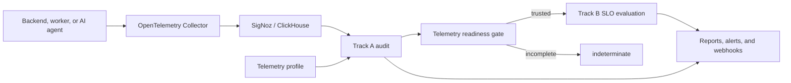

# SRE Sidekick Reliability Agent

The Reliability Agent audits whether an application's telemetry is trustworthy
and then evaluates reliability objectives using that trusted telemetry.

It separates two questions that are commonly mixed together:

1. **Track A — Telemetry quality:** Are the logs, traces, and metrics complete,
   fresh, correctly structured, and safe to use?
2. **Track B — Service reliability:** Does the service meet its SLO, and what is
   its remaining error budget and burn rate?

Track A never decides whether an application SLO passed. It only determines
whether the available telemetry is reliable enough to support that decision.
When evidence is unavailable or incomplete, the agent returns
`indeterminate` rather than inventing a healthy or unhealthy result.

## How it works



Each service supplies its own telemetry profile and SLO configuration. This
allows a normal backend, AI agent, worker, or custom application to use
different fields and rules without receiving irrelevant findings.

## Track A: telemetry quality

Track A checks the quality of observability data, not application health.

Examples of Track A problems:

- logs are missing `trace_id`;
- `service.name` is missing;
- expected spans do not exist;
- logs or metrics stopped arriving;
- an attribute has unbounded cardinality;
- a SigNoz query is incomplete or unavailable.

Supported rule types:

- `required_field`
- `required_span`
- `freshness`
- `cardinality`

Findings have `blocker`, `warning`, or `info` severity and one of these states:

- `pass`
- `fail`
- `indeterminate`
- `not_applicable`

Track A produces a report containing findings, affected counts, coverage,
quality score, recommendations, and overall status.

### Service profiles

Profiles are YAML telemetry contracts. Examples are available in:

- `examples/checkout-api.yaml`
- `examples/support-agent.yaml`
- `examples/demo-agent.yaml`

A profile declares the service, environment, source, expected fields, and
service-specific rules:

```yaml
apiVersion: reliability/v1
kind: TelemetryProfile

metadata:
  name: demo-agent
  service: support-agent
  environment: local

spec:
  data_kind: backend
  source:
    adapter: signoz
    endpoint: http://localhost:8080

  signals:
    logs:
      fields:
        - path: body
          type: string
          required: true
        - path: trace_id
          type: string
          required: true

  audit_rules:
    - id: log-trace-correlation
      type: required_field
      signal: logs
      field: trace_id
      severity: blocker
      recommendation: Attach the active trace ID to every application log.
```

Supported `data_kind` values are `backend`, `ai_agent`, `worker`, and `custom`.

## Track B: SLO evaluation

Track B queries SigNoz using service- and environment-scoped SigNoz builder
queries. It supports:

- success or quality ratios;
- latency-threshold SLIs;
- telemetry-completeness SLIs;
- grounded-answer SLIs for AI agents;
- target comparison;
- remaining error-budget calculation;
- burn-rate calculation;
- `healthy`, `unhealthy`, and `indeterminate` states.

SLOs are configured separately from telemetry audit rules:

```yaml
version: "1"
service: checkout-api
environment: test

slos:
  - name: request-success
    type: ratio
    target: 0.995
    window: 30d
    requires_completeness: true
    completeness_threshold: 0.95
    good_metric: http_server_request_success_total
    total_metric: http_server_request_total
    dependencies:
      - http_server_request_success_total
      - http_server_request_total
```

`good_metric`/`total_metric` name counters only; the engine builds the
actual SigNoz builder query (metric, filter, and `increase`/`sum`
aggregation) itself, scoped to `service`/`environment` and the SLO's
`window`. A config can therefore never end up with a mismatched or
misspelled scope matcher the way a hand-written PromQL query could -
and PromQL label matchers against these OTel metric attributes have
proven unreliable against live SigNoz, which is why Track B does not use
PromQL for SLO reads. Latency queries are built the same way, against the
histogram's `<latency_metric>_bucket`/`<latency_metric>_count` metrics by
default - the OTel semantic-convention underscore suffix a
custom-instrumented histogram normally uses. That default does not fit every
histogram: SigNoz's own zero-instrumentation latency metric
(`signoz_latency`, generated by the spanmetrics processor from trace data)
uses dot-separated child metrics instead (`signoz_latency.bucket`,
`signoz_latency.count`). Set `latency_bucket_metric`/`latency_count_metric`
to override the derived name for histograms like this one; see
`examples/support-agent-slo.yaml` for a working example. Also note
`latency_bucket_unit` (`ms`, the default - matches `signoz_latency`; or `s`
for an OTel semconv `*_duration_seconds` histogram): getting either the
naming convention or the unit wrong does not error, it silently reports a
much lower SLI than reality, so always check a histogram's actual stored
`le` values and child-metric names before relying on a `latency_threshold`
SLO.

Examples:

- `examples/checkout-slo.yaml`
- `examples/support-agent-slo.yaml`

If required metrics are missing, partial, unauthorized, or unavailable, Track B
returns `indeterminate` instead of treating missing data as zero.

## Prerequisites

- Go
- a running SigNoz backend, normally `http://localhost:8080`;
- an OpenTelemetry Collector accepting logs on
  `http://localhost:4318/v1/logs`;
- a SigNoz service-account API key with the built-in Viewer role.

Export the local connection details:

```bash
export SIGNOZ_URL='http://localhost:8080'
export SIGNOZ_API_KEY='YOUR_SERVICE_ACCOUNT_KEY'
```

Do not commit the API key.

## Demo agent: a live, controllable support-agent workload

The repository includes `cmd/demo-agent`, a small program that emits
realistic OpenTelemetry traces, metrics, and logs for a simulated AI support
agent.
It targets `service.name=support-agent`, `deployment.environment=local` by
default, matching `examples/support-agent.yaml` and
`examples/support-agent-slo.yaml`.
It exists so the rest of SRE Sidekick (Track A audit, Track B SLO, and the
RCA agent) has something real to reason about, in either a healthy or a
deliberately broken state.

Each loop iteration simulates one agent run and emits:

- a trace: `agent.run` with three children, `model.chat`, `tool.search_kb`,
  and `evaluation.groundedness`;
- two counters: `agent_evaluated_answers_total` (every run) and
  `agent_grounded_answers_total` (only grounded, successful runs);
- one log record correlated to that run's trace ID.

### 1. Start the demo agent in healthy mode

```bash
go run ./cmd/demo-agent
```

Defaults:

- OTLP/HTTP endpoint: `http://localhost:4318` (env `OTLP_ENDPOINT`);
- `service.name`: `support-agent`;
- `deployment.environment`: `local`;
- interval between runs: `2s`;
- mode: healthy (`--buggy` not set).

In healthy mode, every run succeeds: `tool.search_kb` returns quickly with an
Ok status, `evaluation.grounded` is `true`, and both counters increment.
Over time the grounded-answer SLI in `examples/support-agent-slo.yaml` stays
healthy.

### 2. Start automatic Track A auditing or Track B SLO evaluation

In another terminal, watch the correlated logs:

```bash
go run ./cmd/reliability-agent audit-watch \
  --profile examples/demo-agent.yaml \
  --interval 2s \
  --lookback 15s
```

Or evaluate the grounded-answers SLO directly:

```bash
go run ./cmd/reliability-agent slo \
  --config examples/support-agent-slo.yaml \
  --output json
```

### 3. Switch to buggy mode

Stop the healthy process and restart it with `--buggy`:

```bash
go run ./cmd/demo-agent --buggy
```

In buggy mode, `tool.search_kb` times out on every run by default: the span
gets an `Error` status and a `TimeoutError` exception event (`exception.type`,
`exception.message`, `exception.stacktrace`), the run is not grounded, and
an `ERROR` log correlated to the run's trace ID is emitted.
`agent_evaluated_answers_total` keeps incrementing but
`agent_grounded_answers_total` does not, so the grounded-answer SLI (and its
error budget) starts burning.
This is exactly the failure the RCA agent is meant to diagnose from the
trace: an `agent.run` with a failing `tool.search_kb` child span carrying a
planted `TimeoutError`.

Use `--error-rate` to simulate partial failure instead of a hard outage, for
example `--buggy --error-rate 0.3` fails roughly 30% of runs while the rest
stay healthy.
Use `--runs` to cap the number of simulated runs instead of running until
interrupted, and `--interval` to control how often runs happen.

### Webhook delivery

Console alerts can also be delivered to an HTTP endpoint:

```bash
go run ./cmd/reliability-agent audit-watch \
  --profile examples/demo-agent.yaml \
  --interval 2s \
  --lookback 15s \
  --webhook-url http://localhost:9000/alerts
```

The webhook receives the same firing and resolved JSON documents printed by the
watcher.

Slack communication is handled only by the RCA-driven `watch` command. Alerts
must be delivered to its authenticated webhook listener; the RCA agent gathers
evidence, produces the diagnosis, and the Slack coordinator posts the result.
User follow-up messages are routed back through the same RCA adapter before a
thread reply is sent. `audit-watch` does not send directly to Slack.

## Run an SLO evaluation

```bash
go run ./cmd/reliability-agent slo \
  --config examples/checkout-slo.yaml \
  --output json

# Emit SLO and multi-window burn metrics through OTLP/HTTP
go run ./cmd/reliability-agent slo \
  --config examples/checkout-slo.yaml \
  --emit-otlp \
  --otlp-endpoint localhost:4318

# Idempotently generate the dashboard, channel, and burn alerts
go run ./cmd/reliability-agent generate \
  --config examples/checkout-slo.yaml \
  --webhook-url http://your-alert-receiver/alerts
```

The command uses the SigNoz v5 query API and the service-account key from the
environment.

## Run the HTTP server

```bash
go run ./cmd/reliability-agent \
  --listen 127.0.0.1:8081 \
  --profile examples/checkout-api.yaml
```

The server binds to loopback by default. To expose it on a routable interface,
configure a bearer token and send it in the `Authorization` header:

```bash
export RELIABILITY_AGENT_API_KEY='replace-with-a-secret'
go run ./cmd/reliability-agent --listen 0.0.0.0:8081
curl -H "Authorization: Bearer ${RELIABILITY_AGENT_API_KEY}" \
  http://127.0.0.1:8081/v1/profiles
```

`GET /healthz` remains unauthenticated for health probes. All JSON request
bodies are limited to 1 MiB by default.

Available endpoints:

```text
GET  /healthz
GET  /v1/profiles
GET  /v1/profiles/{name}
POST /v1/profiles
POST /v1/profiles/{name}/validate
POST /v1/profiles/{name}/activate
POST /v1/audit
POST /v1/slo/evaluate
```

`POST /v1/audit` accepts a normalized evidence snapshot and runs the selected
profile. `POST /v1/slo/evaluate` accepts an SLO configuration and performs live
SigNoz scalar queries.

Profiles registered through the API are currently held in memory and are lost
when the process restarts.

## Development

Format and test:

```bash
make fmt
make test
```

Or run directly:

```bash
go test ./...
go vet ./...
```

Run the complete local workflow demo without a live SigNoz installation:

```bash
make demo
```

The demo uses an in-process SigNoz API stub and webhook receiver, but exercises
the real authenticated API, profile registration and activation, Track A audit,
Track B SLO evaluation, completeness gate, alert debounce, webhook delivery,
and recovery transition. A live demo still requires the prerequisites above.

Convenience targets:

```bash
make run
make run-demo-agent
make run-demo-agent-buggy
make watch-logs
```

## Project structure

```text
cmd/reliability-agent       Main server, audit-watch, and SLO CLI
cmd/demo-agent              Traces+metrics+logs demo workload for support-agent
examples                    Telemetry profiles and SLO configurations
internal/profile            Profile model and validation
internal/evidence           Source-neutral telemetry snapshot
internal/source             Telemetry source interface
internal/source/signoz      SigNoz query and normalization adapters
internal/audit              Track A rule engine and scoring
internal/monitor            Scheduled auditing and alert transitions
internal/alerting           JSON and webhook alert delivery
internal/slo                Track B SLI, SLO, budget, and burn-rate engine
internal/api                HTTP API
internal/registry           In-memory profile registry
```

## Current implementation status

Implemented:

- profile-driven telemetry contracts;
- backend, worker, AI-agent, and custom data kinds;
- Track A rule evaluation and scoring;
- live SigNoz log querying and normalization;
- live SigNoz trace and metrics querying and normalization;
- scheduled log audits;
- blocker debounce, duplicate suppression, and recovery alerts;
- console and webhook alert delivery;
- live SigNoz SLO queries;
- OTLP emission of SLO and telemetry-quality metrics;
- idempotent SigNoz dashboard, notification-channel, and burn-alert generation;
- multi-window multi-burn-rate evaluation;
- SLI, target, error-budget, and burn-rate calculations;
- safe `indeterminate` handling;
- unit and end-to-end demo coverage.

Not yet implemented:

- persistent profile, report, and alert storage;
- automatic profile-to-PromQL planning for Track B;
- native SigNoz Alertmanager notification integration;
- distributed scheduler coordination for multiple agent replicas.

The current logs, traces, and metrics source is available to `audit-watch` when
the profile references those signals. The generated OTLP metrics and SigNoz
resources require a running collector/API endpoint and appropriate credentials.
