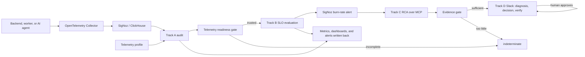

# SRE Sidekick Reliability Agent

An AI SRE agent grounded on SigNoz. It audits whether an application's telemetry
is trustworthy, evaluates reliability objectives against that trusted telemetry,
diagnoses incidents over live traces and logs, and brings the result to a human
in Slack for a decision.

**To run it locally, follow [PLAYBOOK.md](PLAYBOOK.md).** This file explains what
it is and how each part works.

It is organised around four tracks:

1. **Track A — Telemetry quality:** Are the logs, traces, and metrics complete,
   fresh, correctly structured, and safe to use?
2. **Track B — Service reliability:** Does the service meet its SLO, and what is
   its remaining error budget and burn rate?
3. **Track C — Root cause:** Given trustworthy telemetry, what actually broke?
   Evidence is gathered over the SigNoz MCP server and reasoned about by an LLM.
4. **Track D — Interface and action:** A Slack adapter that delivers grounded
   diagnoses, answers questions, and takes a human decision before anything is
   applied.

Track A never decides whether an application SLO passed. It only determines
whether the available telemetry is reliable enough to support that decision.
When evidence is unavailable or incomplete, the agent returns
`indeterminate` rather than inventing a healthy or unhealthy result.

## Two rules the whole system is built on

Everything else is an implementation detail; these two are the product.

**The AI never computes a number.** SLO state, SLI, error budget, burn rate and
telemetry trust are computed by the deterministic engine. The model explains
them and never produces them - not in a diagnosis, not in a chat answer. The
reasoner is not even called when telemetry is untrusted, which
`TestAgent_Diagnose_UntrustedTelemetry_NeverReachesReasoner` enforces.

**It refuses rather than guesses.** If the completeness gate does not trust the
telemetry, or the evidence gate finds too little to reason over, the answer is
`indeterminate` with a stated reason. A confident wrong answer about reliability
is worse than no answer, and this system is designed to prefer the latter.

## How it works



Read the two `indeterminate` edges as the point rather than as error handling.
Untrusted telemetry never reaches the SLO decision, and thin evidence never
reaches the reasoner.

Each service supplies its own telemetry profile and SLO configuration. This
allows a normal backend, AI agent, worker, or custom application to use
different fields and rules without receiving irrelevant findings.

## Track A: telemetry quality

Track A checks the quality of observability data, not application health.

Examples of Track A problems:

- logs are missing `trace_id`;
- `service.name` is missing;
- expected spans do not exist;
- logs or metrics stopped arriving;
- an attribute has unbounded cardinality;
- a SigNoz query is incomplete or unavailable.

Supported rule types:

- `required_field`
- `required_span`
- `freshness`
- `cardinality`

Findings have `blocker`, `warning`, or `info` severity and one of these states:

- `pass`
- `fail`
- `indeterminate`
- `not_applicable`

Track A produces a report containing findings, affected counts, coverage,
quality score, recommendations, and overall status.

### Service profiles

Profiles are YAML telemetry contracts. Examples are available in:

- `examples/checkout-api.yaml`
- `examples/support-agent.yaml`
- `examples/demo-agent.yaml`

A profile declares the service, environment, source, expected fields, and
service-specific rules:

```yaml
apiVersion: reliability/v1
kind: TelemetryProfile

metadata:
  name: demo-agent
  service: support-agent
  environment: local

spec:
  data_kind: backend
  source:
    adapter: signoz
    endpoint: http://localhost:8080

  signals:
    logs:
      fields:
        - path: body
          type: string
          required: true
        - path: trace_id
          type: string
          required: true

  audit_rules:
    - id: log-trace-correlation
      type: required_field
      signal: logs
      field: trace_id
      severity: blocker
      recommendation: Attach the active trace ID to every application log.
```

Supported `data_kind` values are `backend`, `ai_agent`, `worker`, and `custom`.

## Track B: SLO evaluation

Track B queries SigNoz using service- and environment-scoped SigNoz builder
queries. It supports:

- success or quality ratios;
- latency-threshold SLIs;
- telemetry-completeness SLIs;
- grounded-answer SLIs for AI agents;
- target comparison;
- remaining error-budget calculation;
- burn-rate calculation;
- `healthy`, `unhealthy`, and `indeterminate` states.

SLOs are configured separately from telemetry audit rules:

```yaml
version: "1"
service: checkout-api
environment: test

slos:
  - name: request-success
    type: ratio
    target: 0.995
    window: 30d
    requires_completeness: true
    completeness_threshold: 0.95
    good_metric: http_server_request_success_total
    total_metric: http_server_request_total
    dependencies:
      - http_server_request_success_total
      - http_server_request_total
```

`good_metric`/`total_metric` name counters only; the engine builds the
actual SigNoz builder query (metric, filter, and `increase`/`sum`
aggregation) itself, scoped to `service`/`environment` and the SLO's
`window`. A config can therefore never end up with a mismatched or
misspelled scope matcher the way a hand-written PromQL query could -
and PromQL label matchers against these OTel metric attributes have
proven unreliable against live SigNoz, which is why Track B does not use
PromQL for SLO reads. Latency queries are built the same way, against the
histogram's `<latency_metric>_bucket`/`<latency_metric>_count` metrics by
default - the OTel semantic-convention underscore suffix a
custom-instrumented histogram normally uses. That default does not fit every
histogram: SigNoz's own zero-instrumentation latency metric
(`signoz_latency`, generated by the spanmetrics processor from trace data)
uses dot-separated child metrics instead (`signoz_latency.bucket`,
`signoz_latency.count`). Set `latency_bucket_metric`/`latency_count_metric`
to override the derived name for histograms like this one; see
`examples/support-agent-slo.yaml` for a working example. Also note
`latency_bucket_unit` (`ms`, the default - matches `signoz_latency`; or `s`
for an OTel semconv `*_duration_seconds` histogram): getting either the
naming convention or the unit wrong does not error, it silently reports a
much lower SLI than reality, so always check a histogram's actual stored
`le` values and child-metric names before relying on a `latency_threshold`
SLO.

Examples:

- `examples/checkout-slo.yaml`
- `examples/support-agent-slo.yaml`

If required metrics are missing, partial, unauthorized, or unavailable, Track B
returns `indeterminate` instead of treating missing data as zero.

## Track C: root cause

Once Track A trusts the telemetry and Track B says the SLO is burning, Track C
answers *why*. It gathers evidence over the **SigNoz MCP server** - failing
trace trees, exception logs, error concentration - and hands it to an LLM
(DeepSeek via OpenRouter) to explain.

Three gates stand between an incident and an answer:

- **The completeness gate** (Track B) must trust the telemetry for the window.
- **The evidence gate** must find enough to reason over: logs, error spans, or
  exceptions. Too little, and the result is `indeterminate` with a reason.
- **The presentation rules** decide the *shape* of the answer deterministically,
  from thresholds in `configs/sidekick.yaml` - never from the model's own
  confidence. Enough supported golden signals produce a single conclusion; fewer
  produce ranked hypotheses; too few samples produce "could not determine".

Evidence text is treated as hostile input. Log bodies and span attributes are
written by the instrumented application and everything it talks to, so
`internal/rca/sanitize.go` allowlists fields, redacts secret-shaped values,
strips control characters, and caps length before any of it reaches a prompt.

```bash
go run ./cmd/reliability-agent diagnose \
  --service checkout-api --environment local --window 10m \
  --slo-config examples/demo-checkout-slo.yaml
```

## Track D: Slack, questions, and decisions

`watch` runs the Slack adapter and the alert receiver together.

**Incidents.** A SigNoz alert reaches the webhook, the agent grounds and
diagnoses, and posts one message per incident: grounding fields, root cause or
ranked hypotheses, evidence deep links, an advisory action, and Approve /
Decline / Close buttons. One incident is one thread, and that thread is the
session.

**Questions.** Mention the bot and ask in plain English:

```
@sidekick how is checkout-api doing?
@sidekick what's my burn rate?
```

Questions resolve to a closed set of intents, each backed by a deterministic
function in `internal/answer` - `slo_status`, `burn_rate`, `error_budget`,
`telemetry_trust`, `recent_incidents`, `service_inventory`. The model picks the
intent and phrases the result; the numbers come from the engine. An unrecognised
question returns a capability list rather than an improvised answer, and with no
LLM configured the answers still work from deterministic templates.

**Decisions.** Approving records the decision and runs the actuator, which is
advisory by default: it logs the proposal and reports that a human must apply
it. **Verify recovery** re-evaluates the SLO deterministically and reports
whether it actually recovered - it will say "not recovered" rather than confirm
a fix that has not landed.

**Mutations** (changing things in SigNoz from chat) are a typed allowlist in
`internal/mutation` with a before/after diff and button confirmation. They are
**disabled by default** and should stay disabled until `authorization` is
configured, because otherwise any channel member can approve one.

## Cost, limits, and storage

- `llm.limits` bounds tokens and requests per request, per hour, per day, and
  per user or channel, with a circuit breaker for a failing provider. Exhausting
  the budget degrades to deterministic templates and `indeterminate`, never to
  silence.
- `storage.driver` selects `memory` (default), `file`, or `postgres`. In memory
  mode a restart loses open sessions - the bot says so rather than pretending.

## Prerequisites

See **[PLAYBOOK.md](PLAYBOOK.md)** for the full local setup, including the Slack
app, MCP, and the demo application. In short:

- Go 1.25+, Docker, and [`foundryctl`](https://github.com/SigNoz/foundry);
- a running SigNoz with the MCP server enabled;
- a SigNoz service-account API key;
- Slack bot and app-level tokens, for Track D;
- an OpenRouter API key, for Track C.

Credentials are read from the environment and named in `configs/sidekick.yaml`
by variable, never stored in it. Do not commit them.

## Workloads to observe

There are two, and they serve different purposes.

**[`demo-app/`](../demo-app) is the primary one** and what you want for a demo or
for validating a change: a browser frontend, a `checkout-api` backend, and a
`payments` dependency, so a single trace spans all three and a fault in
`payments` produces the diagnosis *"checkout is failing because payments is"*.
Faults are injected from the UI, each with a rate. See its README, and
[PLAYBOOK.md](PLAYBOOK.md) to run it.

**`cmd/demo-agent`, below, is the zero-dependency one**: a single process, no
HTTP surface, no browser. It is what CI and `preflight` use, and it stays the
quickest way to put telemetry into SigNoz without running an application.

### Demo agent: a live, controllable support-agent workload

The repository includes `cmd/demo-agent`, a small program that emits
realistic OpenTelemetry traces, metrics, and logs for a simulated AI support
agent.
It targets `service.name=support-agent`, `deployment.environment=local` by
default, matching `examples/support-agent.yaml` and
`examples/support-agent-slo.yaml`.
It exists so the rest of SRE Sidekick (Track A audit, Track B SLO, and the
RCA agent) has something real to reason about, in either a healthy or a
deliberately broken state.

Each loop iteration simulates one agent run and emits:

- a trace: `agent.run` with three children, `model.chat`, `tool.search_kb`,
  and `evaluation.groundedness`;
- two counters: `agent_evaluated_answers_total` (every run) and
  `agent_grounded_answers_total` (only grounded, successful runs);
- one log record correlated to that run's trace ID.

#### 1. Start the demo agent in healthy mode

```bash
go run ./cmd/demo-agent
```

Defaults:

- OTLP/HTTP endpoint: `http://localhost:4318` (env `OTLP_ENDPOINT`);
- `service.name`: `support-agent`;
- `deployment.environment`: `local`;
- interval between runs: `2s`;
- mode: healthy (`--buggy` not set).

In healthy mode, every run succeeds: `tool.search_kb` returns quickly with an
Ok status, `evaluation.grounded` is `true`, and both counters increment.
Over time the grounded-answer SLI in `examples/support-agent-slo.yaml` stays
healthy.

#### 2. Start automatic Track A auditing or Track B SLO evaluation

In another terminal, watch the correlated logs:

```bash
go run ./cmd/reliability-agent audit-watch \
  --profile examples/demo-agent.yaml \
  --interval 2s \
  --lookback 15s
```

Or evaluate the grounded-answers SLO directly:

```bash
go run ./cmd/reliability-agent slo \
  --config examples/support-agent-slo.yaml \
  --output json
```

#### 3. Switch to buggy mode

Stop the healthy process and restart it with `--buggy`:

```bash
go run ./cmd/demo-agent --buggy
```

In buggy mode, `tool.search_kb` times out on every run by default: the span
gets an `Error` status and a `TimeoutError` exception event (`exception.type`,
`exception.message`, `exception.stacktrace`), the run is not grounded, and
an `ERROR` log correlated to the run's trace ID is emitted.
`agent_evaluated_answers_total` keeps incrementing but
`agent_grounded_answers_total` does not, so the grounded-answer SLI (and its
error budget) starts burning.
This is exactly the failure the RCA agent is meant to diagnose from the
trace: an `agent.run` with a failing `tool.search_kb` child span carrying a
planted `TimeoutError`.

Use `--error-rate` to simulate partial failure instead of a hard outage, for
example `--buggy --error-rate 0.3` fails roughly 30% of runs while the rest
stay healthy.
Use `--runs` to cap the number of simulated runs instead of running until
interrupted, and `--interval` to control how often runs happen.

#### Webhook delivery

Console alerts can also be delivered to an HTTP endpoint:

```bash
go run ./cmd/reliability-agent audit-watch \
  --profile examples/demo-agent.yaml \
  --interval 2s \
  --lookback 15s \
  --webhook-url http://localhost:9000/alerts
```

The webhook receives the same firing and resolved JSON documents printed by the
watcher.

Slack communication is handled only by the RCA-driven `watch` command. Alerts
must be delivered to its authenticated webhook listener; the RCA agent gathers
evidence, produces the diagnosis, and the Slack coordinator posts the result.
User follow-up messages are routed back through the same RCA adapter before a
thread reply is sent. `audit-watch` does not send directly to Slack.

A Slack URL passed to `--webhook-url`, or configured on a generated SigNoz
notification channel, is rejected rather than delivered. There is deliberately
no direct Slack sink: a raw Incoming Webhook cannot carry the Block Kit
rendering, the incident thread, or the approval actions that the Track D adapter
provides, so a diagnosis delivered that way would be strictly worse than one
that went through the pipeline.

## Run an SLO evaluation

```bash
go run ./cmd/reliability-agent slo \
  --config examples/checkout-slo.yaml \
  --output json

# Emit SLO and multi-window burn metrics through OTLP/HTTP
go run ./cmd/reliability-agent slo \
  --config examples/checkout-slo.yaml \
  --emit-otlp \
  --otlp-endpoint localhost:4318

# Idempotently generate the dashboard, channel, and burn alerts
go run ./cmd/reliability-agent generate \
  --config examples/checkout-slo.yaml \
  --webhook-url http://your-alert-receiver/alerts
```

The command uses the SigNoz v5 query API and the service-account key from the
environment.

## Run the HTTP server

```bash
go run ./cmd/reliability-agent \
  --listen 127.0.0.1:8081 \
  --profile examples/checkout-api.yaml
```

The server binds to loopback by default. To expose it on a routable interface,
configure a bearer token and send it in the `Authorization` header:

```bash
export RELIABILITY_AGENT_API_KEY='replace-with-a-secret'
go run ./cmd/reliability-agent --listen 0.0.0.0:8081
curl -H "Authorization: Bearer ${RELIABILITY_AGENT_API_KEY}" \
  http://127.0.0.1:8081/v1/profiles
```

`GET /healthz` remains unauthenticated for health probes. All JSON request
bodies are limited to 1 MiB by default.

Available endpoints:

```text
GET  /healthz
GET  /v1/profiles
GET  /v1/profiles/{name}
POST /v1/profiles
POST /v1/profiles/{name}/validate
POST /v1/profiles/{name}/activate
POST /v1/audit
POST /v1/slo/evaluate
```

`POST /v1/audit` accepts a normalized evidence snapshot and runs the selected
profile. `POST /v1/slo/evaluate` accepts an SLO configuration and performs live
SigNoz scalar queries.

Profiles registered through the API are currently held in memory and are lost
when the process restarts.

## Development

Format and test:

```bash
make fmt
make test
```

Or run directly:

```bash
go test ./...
go vet ./...
```

Run the complete local workflow without a live SigNoz installation:

```bash
make demo
```

The demo drives an in-process SigNoz API stub and webhook receiver, but exercises
the real authenticated API, profile registration and activation, Track A audit,
Track B SLO evaluation, the completeness gate, alert debounce, webhook delivery,
and the recovery transition. A live run still needs the prerequisites above.

Convenience targets:

```bash
make vet
make demo
make run
make run-demo-agent
make run-demo-agent-buggy
make watch-logs
```

## Project structure

```text
cmd/reliability-agent       Every mode: preflight, audit, audit-watch, slo,
                            generate, diagnose, watch, server
cmd/demo-agent              Synthetic single-service workload (CI, preflight)
examples                    Telemetry profiles and SLO configurations
configs/sidekick.yaml       Slack, LLM, storage, limits, presentation rules

internal/profile            Profile model and validation
internal/evidence           Source-neutral telemetry snapshot
internal/source             Telemetry source interface
internal/source/signoz      SigNoz query, normalization, and management APIs
internal/audit              Track A rule engine and scoring
internal/monitor            Scheduled auditing and alert transitions
internal/alerting           JSON and webhook alert delivery
internal/slo                Track B SLI, SLO, budget, and burn-rate engine
internal/otlp               Emits results back to SigNoz as OTLP metrics

internal/mcp                SigNoz MCP client (the RCA read path)
internal/rca                Track C: evidence gates, reasoner, presentation
                            rules, grounding, sanitization
internal/rca/limits         LLM budgets, rate limits, circuit breaker

internal/notify             Notifier interface
internal/notify/slack       Track D: client, Block Kit, coordinator, sessions,
                            Socket Mode, authorization
internal/answer             Deterministic tool surface behind chat answers
internal/session            Incident sessions, TTL, and persistence
internal/act                Actuator interface and the advisory adapter
internal/mutation           Typed, gated SigNoz mutations
internal/detect             Alert webhook receiver and dedup

internal/api                HTTP API
internal/registry           Profile registry
```

The observed application lives outside this module, in
[`demo-app/`](../demo-app) at the repo root: a browser frontend, a
`checkout-api` backend, and a `payments` dependency, with fault sliders. It is
what the profiles and SLO configs named `demo-checkout-*` describe.

## Current implementation status

The whole loop - detect, ground, diagnose, communicate, act, verify - has been
run end to end against a live, stock SigNoz, not only against test doubles.

Implemented:

- profile-driven telemetry contracts; backend, worker, AI-agent, and custom
  data kinds;
- Track A rule evaluation, scoring, and scheduled auditing over live logs,
  traces, and metrics;
- blocker debounce, duplicate suppression, and recovery alerts;
- Track B SLI, target, error-budget, burn-rate, and multi-window multi-burn-rate
  evaluation, with a completeness gate and safe `indeterminate` handling;
- OTLP emission of SLO and telemetry-quality metrics, and idempotent generation
  of the SigNoz dashboard, notification channel, and burn alerts;
- Track C RCA over the MCP server with a real reasoner, evidence gating,
  rule-based presentation, and prompt-injection sanitization;
- Track D Slack: alert-driven diagnoses, Block Kit rendering, incident sessions,
  approve/decline/close decisions, deterministic verify, mention-driven
  question answering over a typed tool surface, click-time authorization, and
  LLM cost limits;
- deploy correlation, session persistence (`memory`, `file`, `postgres`), and
  typed, gated SigNoz mutations;
- unit, integration, and end-to-end coverage, race-clean in CI.

Not yet implemented, and worth knowing before relying on it:

- **multi-instance coordination.** No leader election, so two replicas
  double-diagnose and double-spend;
- **a continuous SLO emitter.** `audit-watch` runs continuously; `slo
  --emit-otlp` is one-shot, so a loop is needed to keep dashboards populated and
  SigNoz's own burn-rate alerts firing;
- **a durable audit trail by default.** Decisions are `slog` lines unless a
  store is configured;
- **health and readiness endpoints on `watch`**, and timeouts on the webhook
  listener;
- **automatic profile-to-PromQL planning** for Track B.

Two known defects, reproduced on more than one service and recorded in
`hackathon/REBUILD-LOG.md`: a Track A traces rule that fails on a field-name
mismatch, and a busy service auditing as `indeterminate` because filling the
query row limit sets `Partial`.
